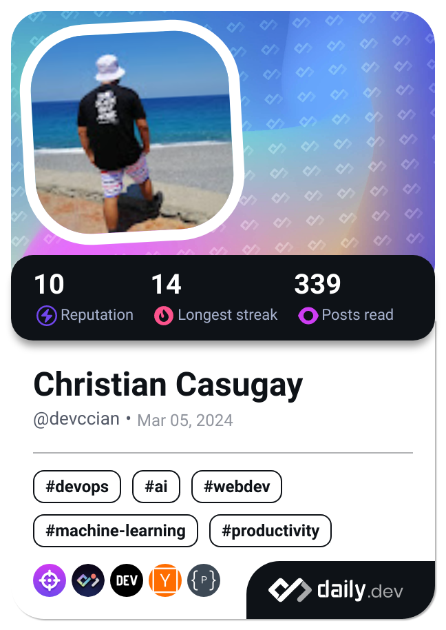

  <ul align="left" style="list-style: none">
    

      <h1>
        👋 Hi, my name is Christian Casugay 😇😊
      </h1>
    

  </ul>

<h3 align="left">Connect with me: </h3>

 
🚀 I’m a passionate backend developer with a strong focus on building scalable, secure, and efficient systems. I enjoy working with server-side technologies, databases, and APIs to create seamless integrations and robust applications.
I'm always learning and striving to write clean, maintainable code. I’m dedicated to improving both the user experience and the developer experience behind the scenes.

Feel free to check out my projects or connect with me!

**<h3 align="left">Rapid Fire</h3>**

- 💼 I'm currently working on: **💻 Developing several projects.**
- 🌱 I'm currently learning: **📚 Exploring Data Engineering, Machine Learning and AI**
- 💬 Ask me about: **💡 JavaScript, TypeScript, Node.js, MySQL, and RESTful APIs**
- ⚡ Fun fact: **💡 When I’m not coding, I’m usually reading about new backend trends or database optimizations.**

 **<h3 align="left">Skills</h3>**

<table style="width: 100%; border: 0px solid white;"><tr><td style="text-align: center; border: 0px; padding: 12px;"></td><td style="text-align: center; border: 0px; padding: 12px;"></td><td style="text-align: center; border: 0px; padding: 12px;"></td><td style="text-align: center; border: 0px; padding: 12px;"></td><td style="text-align: center; border: 0px; padding: 12px;"></td><td style="text-align: center; border: 0px; padding: 12px;"></td></tr><tr><td style="text-align: center; border: 0px; padding: 12px;"></td><td style="text-align: center; border: 0px; padding: 12px;"></td><td style="text-align: center; border: 0px; padding: 12px;"></td><td style="text-align: center; border: 0px; padding: 12px;"></td><td style="text-align: center; border: 0px; padding: 12px;"></td><td style="text-align: center; border: 0px; padding: 12px;"></td></tr><tr><td style="text-align: center; border: 0px; padding: 12px;"></td><td style="text-align: center; border: 0px; padding: 12px;"></td><td style="text-align: center; border: 0px; padding: 12px;"></td><td style="text-align: center; border: 0px; padding: 12px;"></td><td style="text-align: center; border: 0px; padding: 12px;"></td><td style="text-align: center; border: 0px; padding: 12px;"></td></tr><tr><td style="text-align: center; border: 0px; padding: 12px;"></td><td style="text-align: center; border: 0px; padding: 12px;"></td><td style="text-align: center; border: 0px; padding: 12px;"></td><td style="text-align: center; border: 0px; padding: 12px;"></td><td style="text-align: center; border: 0px; padding: 12px;"></td><td style="text-align: center; border: 0px; padding: 12px;"></td></tr><tr><td style="text-align: center; border: 0px; padding: 12px;"></td><td style="text-align: center; border: 0px; padding: 12px;"></td><td style="text-align: center; border: 0px; padding: 12px;"></td><td style="text-align: center; border: 0px; padding: 12px;"></td><td style="text-align: center; border: 0px; padding: 12px;"></td><td style="text-align: center; border: 0px; padding: 12px;"></td></tr><tr><td style="text-align: center; border: 0px; padding: 12px;"></td></table>

 **<h3 align="left">GitHub Stats</h3>**

  

**<h4>Acknowledgements</h4>**
<ul>
  <li>Special thanks to <a href="https://www.github-profile-generator.in/" target="_blank">GitHub Profile Generator</a> for helping with the layout and inspiration for my profile.</li>
  <li>Special thanks to <a href="#"  onclick='window.open("https://www.github-profile-generator.in/"); return false;'>GitHub Profile Generator</a> for helping with the layout and inspiration for my profile. </li>
</ul>

<!--
**8CciaN8/8CciaN8** is a ✨ _special_ ✨ repository because its `README.md` (this file) appears on your GitHub profile.

Here are some ideas to get you started:

- 🔭 I’m currently working on ...
- 🌱 I’m currently learning ...
- 👯 I’m looking to collaborate on ...
- 🤔 I’m looking for help with ...
- 💬 Ask me about ...
- 📫 How to reach me: ...
- 😄 Pronouns: ...
- ⚡ Fun fact: ...
-->
<!--

-->

